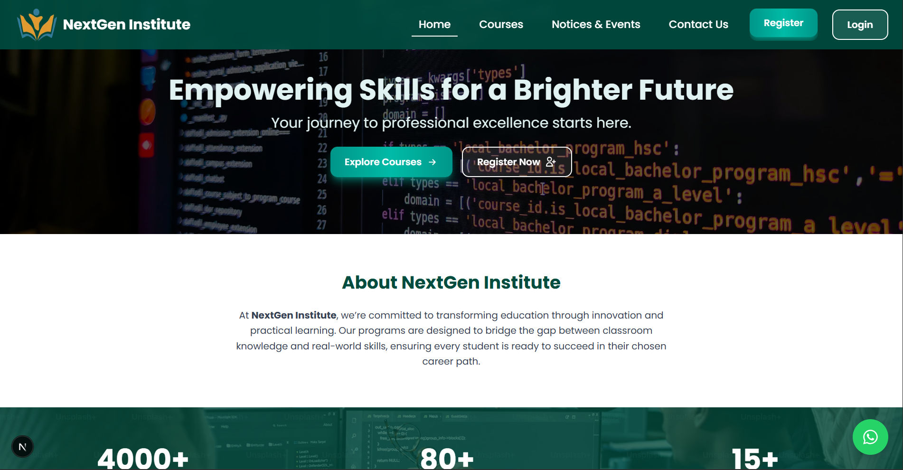
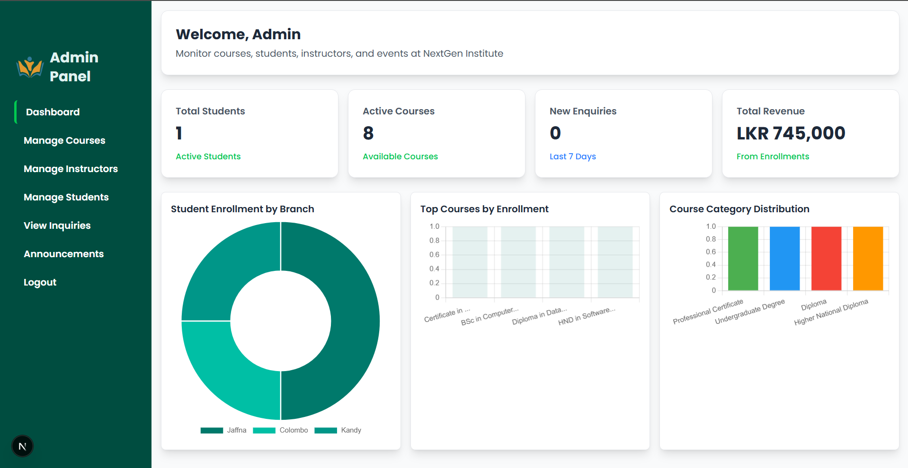
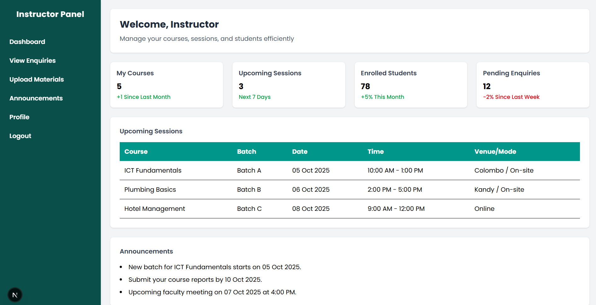
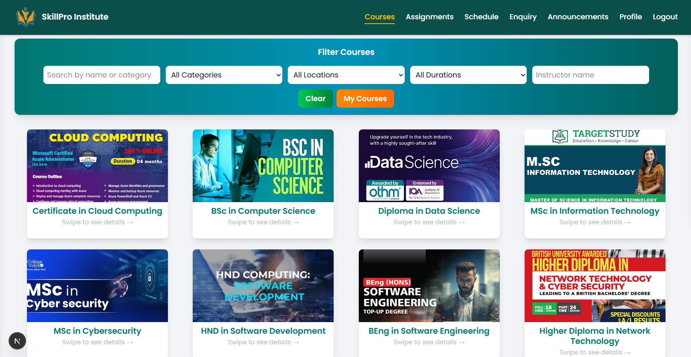

# 🎓 NextGen Institute

<div align="center">

  

  **Empowering students with quality education for a successful future.**

  ### [🚀 View Live Demo](https://nextgen-new.netlify.app/)

  <p align="center">
    <a href="#-features">Features</a> •
    <a href="#-tech-stack">Tech Stack</a> •
    <a href="#-screenshots">Screenshots</a> •
    <a href="#-getting-started">Getting Started</a>
  </p>
</div>

---

## 📖 Overview

**NextGen Institute** is a comprehensive educational management platform built with **Next.js 15** and **Firebase**. It facilitates seamless interaction between Students, Instructors, and Administrators, providing a robust environment for course management, learning material distribution, and student progress tracking.

## ✨ Features

### 🔐 Role-Based Access Control
- **Admin Dashboard**: complete control over courses, instructors, students, and inquiries.
- **Instructor Portal**: upload materials, manage assignments, and view enrolled students.
- **Student Portal**: access enrolled courses, view announcements, download materials, and update profiles.

### 📚 Course & Content Management
- **Dynamic Course Listing**: browse and filter available courses.
- **Material Distribution**: instructors can upload lecture notes and resources.
- **Announcements**: real-time updates for students and staff.

### 🛠 Administrative Tools
- **User Management**: easy onboarding and management of students and instructors.
- **Inquiry Handling**: view and respond to visitor inquiries.
- **Visual Analytics**: dashboard charts powered by Chart.js.

### 🔐 Security & UX
- **Secure Authentication**: powered by Firebase Auth.
- **Password Recovery**: OTP-based password reset using EmailJS.
- **Responsive Design**: fully optimized for mobile and desktop using Tailwind CSS.
- **Modern UI**: clean, intuitive interface with smooth transitions.

## 🛠 Tech Stack

- **Framework:** [Next.js 15](https://nextjs.org/) (App Router, Turbopack)
- **Language:** [TypeScript](https://www.typescriptlang.org/)
- **Styling:** [Tailwind CSS v4](https://tailwindcss.com/)
- **Backend / Database:** [Firebase](https://firebase.google.com/) (Auth, Firestore, Storage)
- **State Management:** React Hooks
- **Icons:** [React Icons](https://react-icons.github.io/react-icons/)
- **Charts:** [Chart.js](https://www.chartjs.org/)
- **Email Service:** [EmailJS](https://www.emailjs.com/)

## 📸 Screenshots

<div align="center">
  
  <br/><br/>
  
  <br/><br/>
  
  <br/><br/>
  
</div>

## 🚀 Getting Started

Follow these steps to run the project locally.

### Prerequisites

- Node.js (v18 or higher)
- npm or yarn
- Firebase Account

### Installation

1.  **Clone the repository**
    ```bash
    git clone https://github.com/TharmathevanDinujan/NextGen.git
    cd nextgen-institute
    ```

2.  **Install dependencies**
    ```bash
    npm install
    ```

3.  **Configure Environment Variables**
    Create a `.env.local` file in the root directory and add your credentials:
    ```env
    NEXT_PUBLIC_FIREBASE_API_KEY=your_api_key
    NEXT_PUBLIC_FIREBASE_AUTH_DOMAIN=your_project_id.firebaseapp.com
    NEXT_PUBLIC_FIREBASE_PROJECT_ID=your_project_id
    NEXT_PUBLIC_FIREBASE_STORAGE_BUCKET=your_project_id.firebasestorage.app
    NEXT_PUBLIC_FIREBASE_MESSAGING_SENDER_ID=your_sender_id
    NEXT_PUBLIC_FIREBASE_APP_ID=your_app_id
    
    NEXT_PUBLIC_ADMIN_EMAIL=admin@gmail.com
    NEXT_PUBLIC_ADMIN_PASSWORD=admin
    
    NEXT_PUBLIC_EMAILJS_SERVICE_ID=your_service_id
    NEXT_PUBLIC_EMAILJS_TEMPLATE_ID=your_template_id
    NEXT_PUBLIC_EMAILJS_PUBLIC_KEY=your_public_key
    ```

4.  **Run the development server**
    ```bash
    npm run dev
    ```

5.  Open [http://localhost:3000](http://localhost:3000) in your browser.

---

<p align="center">
  Developed with ❤️ by <a href="https://nextgen-new.netlify.app/">D_I_N_U</a>
</p>
